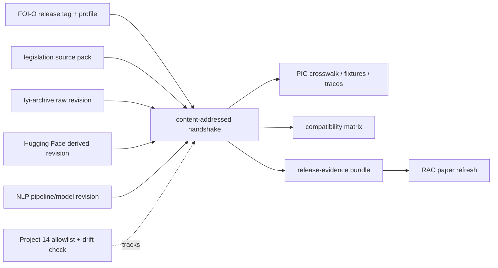

# Design

```mermaid
flowchart LR
  FOI["FOI-O release tag + profile"] --> H["content-addressed handshake"]
  LEG["legislation source pack"] --> H
  RAW["fyi-archive raw revision"] --> H
  HF["Hugging Face derived revision"] --> H
  NLP["NLP pipeline/model revision"] --> H
  H --> PIC["PIC crosswalk / fixtures / traces"]
  H --> MATRIX["compatibility matrix"]
  H --> EVID["release-evidence bundle"]
  EVID --> PAPERS["RAC paper refresh"]
  PROJECT["Project 14 allowlist + drift check"] -.tracks.-> H
```

The handshake is an interchange artifact. FOI-O remains authoritative for its
runtime and ontology; RAC validates the evidence chain and PIC projections.
