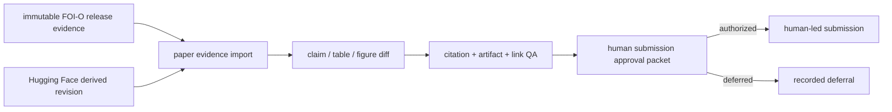

# Design

```mermaid
flowchart LR
  RELEASE["immutable FOI-O release evidence"] --> IMPORT["paper evidence import"]
  IMPORT --> DIFF["claim / table / figure diff"]
  DIFF --> QA["citation + artifact + link QA"]
  QA --> PACKET["human submission approval packet"]
  PACKET -->|authorized| SUBMIT["human-led submission"]
  PACKET -->|deferred| HOLD["recorded deferral"]
  HF["Hugging Face derived revision"] --> IMPORT
```
