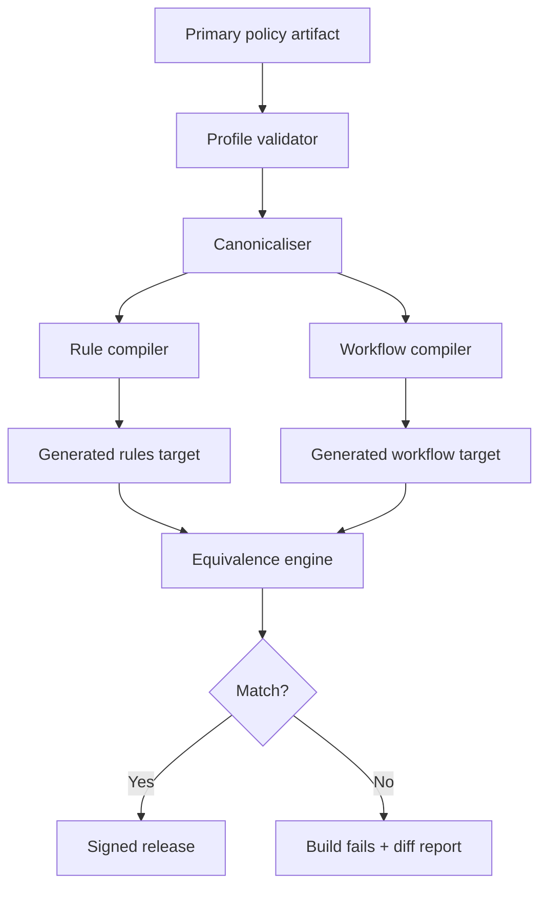
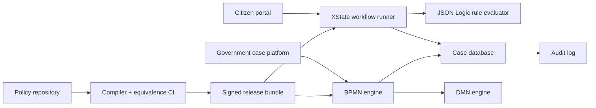

# Assistant output 1 - developed solution

I’ll develop the attached idea into a buildable **MVP architecture**. The core concept is strong: treat laws and policies as two synchronized, executable representations—an enterprise/legal-audit representation using **BPMN + DMN**, and a web/app representation using **XState + JSON Logic**—with deterministic compilers and equivalence tests between them. The attached document already frames this as a dual-representation Rules-as-Code platform with a deterministic compiler, zero runtime AI, and an equivalence-testing layer.

## 1. Refined solution: “PolicyTwin”

**PolicyTwin** is a rules-and-process compiler platform for public policy. It converts legislation, policy manuals, or administrative procedures into two synchronized executable targets:

| Layer | Enterprise / audit target | Web / application target | Purpose |
|---|---|---|---|
| Rules / calculations | DMN + FEEL | JSON Logic | Eligibility, thresholds, rates, calculations, classifications |
| Process / workflow | BPMN | XState | Applications, evidence collection, approvals, reviews, payments |
| Source provenance | Akoma Ntoso / LegalDocML references | Same references embedded in JSON metadata | Trace each rule/process step back to law or policy text |
| Semantic registry | JSON-LD / ontology-like glossary | Same glossary | Prevent “income” meaning different things in different systems |

OpenFisca and PolicyEngine remain useful comparators, but they mainly address computable tax/benefit rules and microsimulation. OpenFisca describes itself as an engine for writing rules as code and calculating tax/benefit outputs from input situations; it can also simulate budgetary and distributional effects on population data. PolicyEngine similarly focuses on open-source tax and benefit analysis and policy reform modeling. The gap this solution addresses is **rules plus administrative process**: not only “is the person eligible?” but “what happens next, who reviews it, what evidence is required, and when is payment triggered?”

The architecture should keep the attached solution’s “no runtime AI” principle. AI can help extract, draft, test, and audit rules, but production eligibility and workflow execution must be deterministic.

## 2. Important correction: avoid claiming full universal translation

The attached proposal says the mapping between BPMN/DMN and XState/JSON Logic is “entirely mathematical and structural” and that most compilation can be deterministic. That is directionally right, but only for a **constrained profile**.

A complete arbitrary BPMN process cannot always translate cleanly to XState, and arbitrary DMN/FEEL cannot always translate to JSON Logic without semantic loss. BPMN includes rich process semantics. DMN includes graphical decision modeling, expression logic, decision tables, and XML interchange, and is designed to work alongside BPMN. JSON Logic, by contrast, is deliberately small: it represents one decision, has no loops, no setters, no functions or gotos, and has deterministic computation time. XState is a JavaScript/TypeScript state-machine/statechart and actor-model orchestration framework, not a government workflow standard.

So the MVP should define a **Rules-as-Code Portable Profile v0.1**. This profile is the contract. The compiler may use an internal AST, but the product does **not** need to store a third “law IR” as the official source of truth.

## 3. Core design principle

The safer design is:

**One source of truth per release, two executable projections.**

That means a policy package can be authored in either environment:

- a policy/legal modeller edits BPMN + DMN; or
- a product team edits XState + JSON Logic.

But each release declares one representation as `primary`. The other representation is generated and locked. This prevents silent divergence.

Example:

```json
{
  "policy_id": "example-income-support",
  "version": "0.1.0",
  "primary_representation": "web-json",
  "targets": {
    "web": {
      "workflow": "workflows/application.xstate.json",
      "rules": ["rules/eligibility.jsonlogic", "rules/payment_amount.jsonlogic"]
    },
    "enterprise": {
      "workflow": "generated/application.bpmn.xml",
      "rules": ["generated/eligibility.dmn.xml", "generated/payment_amount.dmn.xml"]
    }
  },
  "semantic_registry": "semantic/variables.jsonld",
  "test_suite": "tests/equivalence.cases.json",
  "legal_sources": ["sources/instrument.akn.xml"]
}
```

## 4. MVP scope: Portable Profile v0.1

The first version should intentionally support a small but useful subset.

| Area | Include in v0.1 | Exclude until later |
|---|---|---|
| Data types | Boolean, string, integer, decimal, date, enum | Free-form objects, arbitrary lists, time zones beyond specified policy zone |
| Money | Decimal with fixed rounding policy | Floating-point currency calculations |
| Rule logic | `if`, `and`, `or`, `not`, comparisons, arithmetic, min/max, date comparisons | Loops, recursion, user-defined functions, side effects |
| DMN | Decision tables, literal expressions, `UNIQUE` and `FIRST` hit policies | Complex boxed contexts, relations, advanced FEEL functions |
| JSON Logic | One decision per rule, side-effect-free expressions | Custom operators unless registered in the profile |
| BPMN | Start/end events, user tasks, service tasks, business rule tasks, exclusive gateways, simple timers | Parallel gateways, compensation, transactions, complex subprocesses, message choreography |
| XState | Initial/final states, event transitions, guards, invokes, simple delays | Deep actor hierarchies, uncontrolled side effects, non-deterministic services |
| Provenance | Every rule/state maps to source text | Unattributed generated rules |
| AI | Drafting, extraction, tests, semantic review | Runtime eligibility decisions |

For standards alignment, use **BPMN 2.0.2** for process diagrams. For DMN, target the latest formal version supported by the selected execution engine.

## 5. Repository structure

A practical repository should look like this:

```text
policytwin-example/
  policy.manifest.json

  sources/
    instrument.akn.xml
    explanatory-notes.md

  semantic/
    variables.jsonld
    units.json
    code-lists.json

  rules/
    eligibility.jsonlogic
    payment_amount.jsonlogic
    review_required.jsonlogic

  workflows/
    application.xstate.json

  generated/
    eligibility.dmn.xml
    payment_amount.dmn.xml
    review_required.dmn.xml
    application.bpmn.xml

  tests/
    golden.cases.json
    generated-boundary.cases.json
    property-test.config.json

  traces/
    sample-decision-trace.json
    sample-workflow-trace.json

  compiler/
    profile.schema.json
    src/
      jsonlogic-to-dmn.ts
      dmn-to-jsonlogic.ts
      xstate-to-bpmn.ts
      bpmn-to-xstate.ts
      canonicalise.ts
      validate-profile.ts
      equivalence-runner.ts
```

## 6. Semantic registry

This is the most important design addition. A compiler can map `income < 40000`, but it cannot know whether `income` means gross income, taxable income, adjusted family income, annual income, monthly income, or income after deductions. The attached document recognises this semantic-metadata problem: a programmatic script can map structures, but an agent or semantic layer is needed to prevent variables like `income` from drifting in meaning.

Example registry entry:

```json
{
  "@context": {
    "pt": "https://example.org/policytwin/",
    "schema": "https://schema.org/"
  },
  "@id": "pt:adjusted_household_income",
  "label": "Adjusted household income",
  "type": "decimal",
  "unit": "AUD_per_year",
  "period": "financial_year",
  "rounding": {
    "mode": "half_up",
    "scale": 2
  },
  "definition": "Household income after disregards and allowable deductions.",
  "legal_refs": [
    {
      "source": "sources/instrument.akn.xml",
      "section": "s12",
      "text_anchor": "adjusted household income"
    }
  ],
  "privacy_class": "personal_financial"
}
```

## 7. Compiler architecture

The compiler should have five deterministic stages.



### Rule compiler

For v0.1, support JSON Logic like:

```json
{
  "if": [
    { "<": [{ "var": "adjusted_household_income" }, 40000] },
    { "*": [{ "var": "adjusted_household_income" }, 0.10] },
    { "*": [{ "var": "adjusted_household_income" }, 0.20] }
  ]
}
```

Compile it to either a DMN decision table or a DMN literal expression using FEEL. For many calculations, a DMN literal expression is cleaner than forcing every `if` into a decision table. Use decision tables where the rule is naturally tabular: rates, thresholds, eligibility combinations, categories, age bands.

Do not compute inverse conditions naïvely. The attached example suggests translating the `else` branch into an inverse condition such as `>= 40000`. That is safe for a simple numeric comparison, but not always safe for missing values, nulls, dates, compound conditions, or three-valued logic. The safer v0.1 approach is ordered evaluation:

```text
Rule 1: if condition is true, output then_branch
Rule 2: otherwise, output else_branch
```

Then define exactly how `null`, missing data, and invalid data behave.

### Workflow compiler

For v0.1, map:

| XState | BPMN |
|---|---|
| `initial` | start event + first sequence flow |
| state | user task or service task |
| `invoke` rule call | business rule task |
| guarded transition | exclusive gateway + condition expression |
| final state | end event |
| `after` delay | timer event |

## 8. Equivalence engine

The equivalence engine is the safety case. It should perform four checks.

| Check | Purpose |
|---|---|
| Schema conformance | Reject unsupported constructs before compilation |
| Round-trip canonicalisation | Ensure `A -> B -> A` and `B -> A -> B` return the same normalised result |
| Golden test cases | Check examples from legislation, policy manuals, and known edge cases |
| Property/boundary testing | Generate synthetic people/cases around thresholds, dates, missing values, and category boundaries |

Compare not only the final decision, but also the **decision trace**.

## 9. Runtime architecture

Production runtime should be boring and deterministic.



Runtime rules:

1. No LLM calls during eligibility calculation, case routing, payment amount calculation, or refusal generation.
2. Every decision emits a machine-readable trace.
3. Every release is signed and content-addressed.
4. Every generated artifact includes the compiler version, profile version, source hash, and semantic registry hash.
5. Human approval is required before deployment.

## 10. MoSCoW requirements

### Must have

- Portable Profile v0.1
- Deterministic compiler
- Source-of-truth declaration
- Semantic registry
- Provenance
- Equivalence tests
- Decimal-safe calculation
- No runtime AI
- Audit trail
- Human approval workflow

### Should have

- Agentic drafting
- Semantic conflict detector
- Visual BPMN layout
- OpenAPI service wrapper
- Differential testing against existing tools
- Legal explanation generator

### Could have

- CMMN support
- SHACL validation
- LegalRuleML export
- Administrative friction simulation
- Formal verification
- Public policy sandbox

### Won’t have in MVP

- Full BPMN/DMN coverage
- Arbitrary Python execution
- Full natural-language legal interpretation
- Runtime LLM decisions
- Automatic proof of legal validity

## 11. Pilot use case

The best pilot is a bounded benefit or entitlement workflow, not an entire tax system. A suitable first pilot is simple income support eligibility and payment routing with identity verification, residence status, age/dependent status, income threshold, payment calculation, manual review, refusal, and audit trace.

## 12. Implementation roadmap

- Phase 0: Profile and semantics, 2-3 weeks.
- Phase 1: Rule compiler, 4-6 weeks.
- Phase 2: Workflow compiler, 4-6 weeks.
- Phase 3: End-to-end release pipeline, 4 weeks.
- Phase 4: Agent-assisted authoring, 4-8 weeks.

## 13. Key risks and mitigations

| Risk | Mitigation |
|---|---|
| “100% translation” overclaim | Limit to Portable Profile v0.1 and reject unsupported constructs |
| Semantic drift | Use mandatory semantic registry and source references |
| Rounding errors | Use fixed decimal arithmetic and explicit rounding per variable |
| Missing data ambiguity | Define absent/null/unknown semantics upfront |
| Dual-source conflicts | One primary source per release; generated target is locked |
| Tool version drift | Pin compiler, BPMN/DMN, XState, JSON Logic, and evaluator versions |
| AI hallucination | AI output is draft-only; validators and humans approve |
| Legal invalidity | Preserve provenance and require legal/policy sign-off |
| Citizen explanation errors | Generate explanations from traces and approved text templates |

## 14. The first concrete build

The first working prototype should include only one policy:

```text
Policy: example-income-support
Rule 1: eligible if age >= 18 and adjusted_household_income < 40000
Rule 2: payment = 4000 if income < 40000 else 0
Rule 3: manual review required if income is missing or identity confidence < 0.9
Workflow: collect evidence -> verify identity -> calculate eligibility -> route to payment/review/refusal
Targets: JSON Logic + XState, generated DMN + BPMN
Tests: 50 golden cases + generated boundary cases around age 18 and income 40000
```

Success criterion:

```text
For every test case:
  JSON Logic output == DMN output
  XState transition trace == BPMN token trace
  decision explanation references the same source provisions
  no unsupported construct is present
  no runtime AI is called
```
