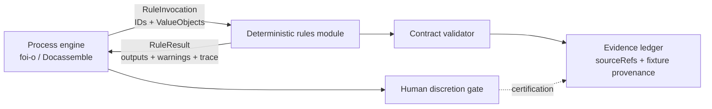

# Figure 1. Typed rules/process boundary

```mermaid
flowchart LR
    P[Process engine\nfoi-o / Docassemble] -->|RuleInvocation\nIDs + ValueObjects| R[Deterministic rules module]
    R -->|RuleResult\noutputs + warnings + trace| P
    R --> V[Contract validator]
    V --> E[Evidence ledger\nsourceRefs + fixture provenance]
    P --> D[Human discretion gate]
    D -. certification .-> E
```

The diagram is conceptual. It does not assert that every consumer implements every message shape or that discretionary decisions are computable.
