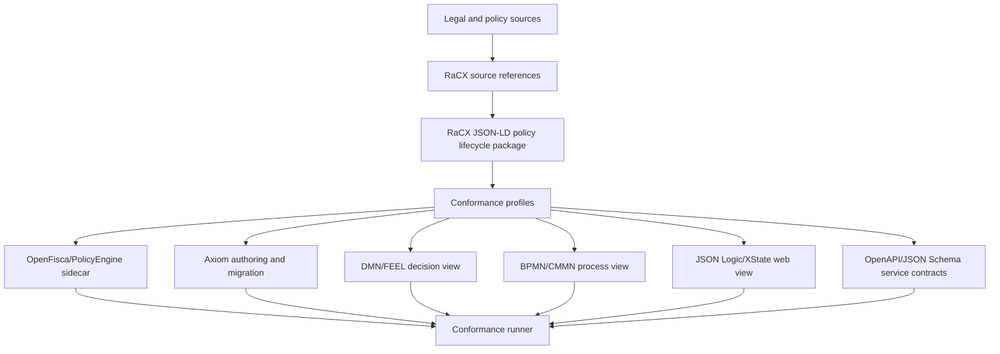

# RaCX architecture

## Architectural position

RaCX is a narrow-waist exchange layer for Rules-as-Code ecosystems. It does not execute all policy by itself. It lets existing engines share policy semantics, parameters, tests, traces, source references, and profiled rule/process structures.

## Conceptual architecture

## Design principles

1. **Support, do not replace.** OpenFisca, PolicyEngine, and Axiom should keep their strengths.
2. **Canonical exchange package, multiple projections.** RaCX is the exchange contract; engines may remain native.
3. **Profiles over totality.** Engines can adopt only relevant profiles.
4. **Rules/process proximity with typed coupling.** A process step can require evidence, invoke decisions, issue notices, and produce traces without making the decision itself workflow-specific.
5. **Deterministic conformance.** AI can help generate artifacts, but conformance and runtime decisions are deterministic.
6. **Trace-first assurance.** Compare outputs plus rule paths, source refs, parameter versions, and process paths.

## Main modules

| Module | Purpose |
|---|---|
| Core | Package, IDs, concepts, mappings, provenance. |
| Calc | Variables, parameters, expressions, rounding, periods. |
| Simulation | Population entities, weights, scenarios, metrics. |
| Evidence | Required evidence, verification, confidence, expiry. |
| Process | Process/case steps, transitions, decision invocations, notices. |
| Trace | Decision/process trace format and equivalence. |
| Test | Golden, boundary, property, and regression fixtures. |

## Open question

Should RaCX be positioned publicly as a "superset", a "profile", a "crosswalk", a "policy package", or a "conformance layer"? Internally it behaves like a canonical exchange model; externally adoption may be easier if framed as sidecar-compatible profiles.
