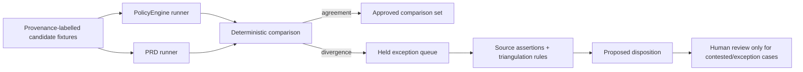

# Figure 1. Differential-testing and adjudication pipeline

```mermaid
flowchart LR
    F[Provenance-labelled candidate fixtures] --> A[PolicyEngine runner]
    F --> B[PRD runner]
    A --> C[Deterministic comparison]
    B --> C
    C -->|agreement| G[Approved comparison set]
    C -->|divergence| H[Held exception queue]
    H --> S[Source assertions + triangulation rules]
    S --> O[Proposed disposition]
    O --> M[Human review only for contested/exception cases]
```
